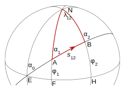

# geographiclib-go
Author: Nathan McIntosh

## About
A golang port of [geographiclib](https://geographiclib.sourceforge.io/).

## Aims
 - Mimic the [rust port](https://github.com/georust/geographiclib-rs), the [python port](https://pypi.org/project/geographiclib/), and the [java port](https://github.com/geographiclib/geographiclib-java) as closely as possible
 - Test as extensively as possible. Match all the rust, python, and java tests

## Outline:
- [Background: Geodesics on an Ellipsoid](#background-geodesics-on-an-ellipsoid)
- [Short Explanation](#short-explanation-of-library)
- [Long Explanation](#long-explanation-of-library)
- [GeographicLib API](#geographiclib-api)
- [Examples](#examples)
- [Progress](#progress)

## Short Explanation of Library
This library can calculate the following:
- Given a latitude/longitude point, an angle from due North, and a distance, calculate the latitude/longitude of the new point. This is calculated with any function starting with `DirectCalc...`
- Given two latitude/longitude points, calculate the distance between them, and the angles formed from due North to the line connecting the two points. This is calculated with any function starting with `InverseCalc...`
- Given a set of points or edges that form a polygon, calculate the area of said polygon. This is done by calling `NewPolygonArea()`, adding the points, and finally calling the `Compute()` method to get both the area and the perimeter of the polygon.
- Given a set of points or edges that form a polyline (a set of connected lines), calculate the perimeter of the line. This is done by calling `NewPolygonArea()` with `is_polyline` set to true, adding the points, and finally calling the `Compute()` method to get the length of the lines.

## Long Explanation of Library
This section is copied from the [python documentation](https://geographiclib.sourceforge.io/Python/doc/geodesics.html)
### Introduction
Consider an ellipsoid of revolution with equatorial radius $a$, polar semi-axis $b$, and flattening $f = (a − b)/a$ . Points on the surface of the ellipsoid are characterized by their latitude $\phi$ and longitude $\lambda$. (Note that latitude here means the geographical latitude, the angle between the normal to the ellipsoid and the equatorial plane).

The shortest path between two points on the ellipsoid at $(\phi_1, \lambda_1)$ and $(\phi_2, \lambda_2)$ is called the geodesic. Its length is $s_{12}$ and the geodesic from point 1 to point 2 has forward azimuths $\alpha_1$ and $\alpha_2$ at the two end points. In this figure, we have $\lambda_{12} = \lambda_2 − \lambda_1$.

A geodesic can be extended indefinitely by requiring that any sufficiently small segment is a shortest path; geodesics are also the straightest curves on the surface.

### Solution of Geodesic Problems
Traditionally two geodesic problems are considered:

- the direct problem — given $\phi_1$, $\lambda_1$, $\alpha_1$, $s_{12}$, determine $\phi_2$, $\lambda_2$, and $\alpha_2$; this is solved by the various functions starting with `DirectCalc...`

- the inverse problem — given $\phi_1$, $\lambda_1$, $\phi_2$, $\lambda_2$, determine $s_{12}$, $\alpha_1$, and $\alpha_2$; this is solved by the various functions starting with `InverseCalc...`

### Aditional Properties
The routines also calculate several other quantities of interest

- $S_{12}$ is the area between the geodesic from point 1 to point 2 and the equator; i.e., it is the area, measured counter-clockwise, of the quadrilateral with corners $(\phi_1,\lambda_1), (0,\lambda_1), (0,\lambda_2)$, and $(\phi_2,\lambda_2)$. It is given in $\text{meters}^2$.

- $m_{12}$, the reduced length of the geodesic is defined such that if the initial azimuth is perturbed by $\delta\alpha_1$ (radians) then the second point is displaced by $m_{12}\ \delta\alpha_1$ in the direction perpendicular to the geodesic. $m_{12}$ is given in meters. On a curved surface the reduced length obeys a symmetry relation, $m_{12} + m_{21} = 0$. On a flat surface, we have $m_{12} = s_{12}$.

- $M_{12}$ and $M_{21}$ are geodesic scales. If two geodesics are parallel at point 1 and separated by a small distance $\delta t$, then they are separated by a distance $M_{12} \delta t$ at point 2. $M_{21}$ is defined similarly (with the geodesics being parallel to one another at point 2). $M_{12}$ and $M_{21}$ are dimensionless quantities. On a flat surface, we have $M_{12} = M_{21} = 1$.

- $\sigma_{12}$ is the arc length on the auxiliary sphere. This is a construct for converting the problem to one in spherical trigonometry. The spherical arc length from one equator crossing to the next is always $180 \degree$.

If points 1, 2, and 3 lie on a single geodesic, then the following addition rules hold:

- $s_{13} = s_{12} + s_{23}$
- $\sigma_{13} = \sigma_{12} + \sigma_{23}$
- $S_{13} = S_{12} + S_{23}$
- $m_{13} = m_{12}M_{23} + m_{23}M_{21}$
- $M_{13} = M_{12}M_{23} − (1 − M_{12}M_{21}) m_{23}/m_{12}$
- $M_{31} = M_{32}M_{21} − (1 − M_{23}M_{32}) m_{12}/m_{23}$

### Multiple Shortest Geodesics
The shortest distance found by solving the inverse problem is (obviously) uniquely defined. However, in a few special cases there are multiple azimuths which yield the same shortest distance. Here is a catalog of those cases:

- $\phi_1 = −\phi_2$ (with neither point at a pole). If $\alpha_1 = \alpha_2$, the geodesic is unique. Otherwise there are two geodesics and the second one is obtained by setting 
    - $[\alpha1,\alpha2] \leftarrow [\alpha2,\alpha1]$
    - $[M_{12},M_{21}] \leftarrow [M_{21},M_{12}]$
    - $S12 \leftarrow −S12$

    (This occurs when the longitude difference is near $\pm 180 \degree$ for oblate ellipsoids.)
- $\lambda_2 = \lambda_1 \pm 180 \degree$ (with neither point at a pole). If $\alpha_1 = 0 \degree$ or $\pm 180 \degree$, the geodesic is unique. Otherwise there are two geodesics and the second one is obtained by setting
    - $[\alpha1,\alpha2] \leftarrow [−\alpha1,−\alpha2]$
    - $S12 \leftarrow −S12$
    
    (This occurs when $\phi_2$ is near $−\phi_1$ for prolate ellipsoids.)
- Points 1 and 2 at opposite poles. There are infinitely many geodesics which can be generated by setting $[\alpha1,\alpha2] \leftarrow [\alpha1,\alpha2] + [\delta,−\delta]$, for arbitrary $\delta$. (For spheres, this prescription applies when points 1 and 2 are antipodal.)
- $s_{12} = 0$ (coincident points). There are infinitely many geodesics which can be generated by setting $[\alpha1,\alpha2] \leftarrow [\alpha1,\alpha2] + [\delta,\delta]$, for arbitrary $\delta$.

### Area of a Polygon
The area of a geodesic polygon can be determined by summing $S_{12}$ for successive edges of the polygon ($S_{12}$ is negated so that clockwise traversal of a polygon gives a positive area). However, if the polygon encircles a pole, the sum must be adjusted by $\pm A/2$, where $A$ is the area of the full ellipsoid, with the sign chosen to place the result in $(-A/2, A/2]$.

## The library Interface

## GeographicLib API

## Examples
- [ ] Add Examples to README
    - [ ] Examples of direct case on Earth
    - [ ] Examples of direct case on Mars
    - [ ] Examples of inverse case
    - [ ] Examples of calculating an area

## Progress
- [X] Go translation
    - [X] Geomath
    - [X] Geomath tests
    - [X] Geodesic Capability constants
    - [X] Geodisic Direct
    - [X] Geodisic Direct tests
    - [X] Geodisic line
    - [X] Geodisic line tests
    - [X] Geodisic Inverse
    - [X] Geodisic Inverse tests
    - [X] Polygon Area
    - [X] Polygon Area tests
- [ ] Consider switching from having units in names to using github.com/golang/geo/ which uses types for units. It would perhaps involve more allocations; need to do some testing.